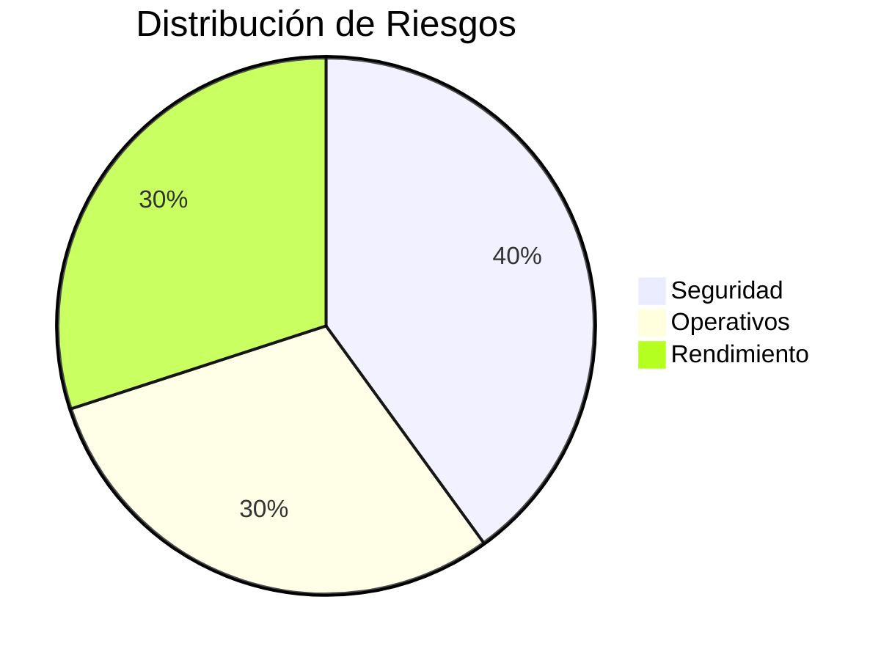

# FD01 - Informe de Factibilidad

## 1. Descripción del Proyecto
### Nombre del Proyecto
Motor de Enmascarado de Datos Multiformato (Enmascaradazo)

### Descripción General
El proyecto consiste en el desarrollo e implementación de una plataforma de enmascaramiento de datos diseñada para proteger información sensible y confidencial a través de múltiples motores de bases de datos y formatos. Esta herramienta permite desensibilizar datos para su uso en entornos no productivos (desarrollo, pruebas, QA) garantizando el cumplimiento de normativas de privacidad.

### Objetivo General
Proveer una solución unificada, escalable y segura para el enmascaramiento de datos estructurados y no estructurados en diversas plataformas de almacenamiento de datos.

### Objetivos Específicos
- Desarrollar módulos de conexión para al menos 5 tipos de bases de datos (SQL Server, MySQL, PostgreSQL, MongoDB, etc.).
- Implementar un catálogo de técnicas de desensibilización (sustitución, barajado, encriptación, etc.).
- Proveer una interfaz gráfica amigable para la configuración y monitoreo del proceso.
- Generar reportes de auditoría detallados sobre los procesos de enmascarado ejecutados.

### Alcance
#### Incluido en el Proyecto (Funcionalidades Entregables)
- Motor core de enmascaramiento.
- Interfaz web de configuración (Dashboard).
- Soporte para bases de datos relacionales y NoSQL.
- Generación de logs y reportes.

#### Excluido del Proyecto (Fuera de Alcance)
- Limpieza de datos (Data Cleansing) previa al enmascarado.
- Replicación automática de bases de datos de producción a entornos de prueba.
- Modificación estructural de las bases de datos origen (DDL).

---

## 2. Riesgos



### Riesgos de Seguridad
- **Fuga de datos durante el proceso:** Mitigado mediante procesamiento en memoria y no persistencia temporal.
- **Acceso no autorizado al panel:** Mitigado con control de acceso basado en roles (RBAC) y autenticación JWT.

### Riesgos Operativos
- **Incompatibilidad con versiones antiguas de DB:** Mitigado mediante el uso de drivers estándar y validación previa de conexión.
- **Falta de adopción por usuarios:** Mitigado con capacitación y una interfaz de usuario altamente intuitiva.

### Riesgos de Rendimiento
- **Cuellos de botella con grandes volúmenes de datos:** Mitigado mediante procesamiento por lotes (batch processing) y multithreading.
- **Sobrecarga de la red:** Mitigado instalando el motor cerca de los orígenes de datos.

### Evaluación General de Riesgos
El proyecto presenta un riesgo general moderado-bajo, con planes de mitigación claros y tecnología estándar para resolverlos.

---

## 3. Análisis de la Situación Actual

### 3.1. Procesos Manuales y Fragmentados de Extracción de Datos
Actualmente, los desarrolladores y QA extraen datos de producción mediante scripts manuales, lo que incrementa el riesgo de error humano.

### 3.2. Heterogeneidad de Motores y Ausencia de una Solución Unificada
Existen diferentes soluciones parciales para cada motor de base de datos, lo que requiere que el personal aprenda múltiples herramientas.

### 3.3. Problemas de Rendimiento y Cuellos de Botella
Los scripts actuales son lentos y bloquean las tablas de producción durante su ejecución.

### 3.4. Riesgos de Seguridad y Exposición de Datos Sensibles
Los entornos de desarrollo contienen copias exactas de datos reales, incluyendo PII (Información Personalmente Identificable), exponiendo a la empresa a multas.

### 3.5. Ausencia de Auditoría y Trazabilidad
No hay un registro centralizado de qué datos se han exportado y quién los ha desensibilizado.

### 3.6. Elevados Costos Operativos y de Mantenimiento
El mantenimiento de múltiples scripts a medida representa un gasto elevado de horas-hombre.

### 3.7. Análisis de Brechas y Necesidades No Cubiertas
Existe una necesidad imperante de centralizar y automatizar estas tareas a través de una única interfaz agnóstica al motor.

---

## 4. Factibilidad Técnica

### Descripción
El equipo cuenta con las competencias necesarias en desarrollo backend y frontend, y las herramientas requeridas son de código abierto o accesibles.

### Hardware Requerido
- Servidor de Aplicaciones (4 vCPU, 8GB RAM).
- Espacio en Disco: 50GB (principalmente para logs de aplicación).

### Software Requerido
- Docker y Docker Compose para contenedores.
- Sistema Operativo: Linux (Ubuntu/Debian) o Windows Server.

### Lenguajes y Frameworks
- **Desarrollo Web:** React.js / Vue.js, TailwindCSS.
- **Backend:** Node.js, Python o Java (Dependiendo del stack preferido), FastAPI / Express.
- **Bases de Datos:** PostgreSQL para persistencia de metadatos de configuración.

### Herramientas Complementarias
- Git / GitHub para control de versiones.
- SonarQube para calidad de código.

### Disponibilidad de la Tecnología
Todas las tecnologías seleccionadas son maduras, con soporte extenso de la comunidad.

### Disponibilidad del Personal
Se cuenta con desarrolladores Full Stack con experiencia en el stack seleccionado.

### Viabilidad de Integración
Los drivers para los distintos motores de BD están disponibles y probados en los lenguajes de backend propuestos.

---

## 4.2 Factibilidad Económica

```mermaid
barChart
    title Proyección de Costos vs Ahorros (Primer Año)
    x-axis Meses
    y-axis Miles USD
    "Inversión Inicial" : 15
    "Costos Operativos" : 5
    "Ahorro Estimado" : 25
```

### Conclusión sobre la Factibilidad Económica
El proyecto tiene un ROI proyectado de 6 meses debido a la gran cantidad de horas-hombre ahorradas en scripts manuales y prevención de multas.

---

## 4.4 Factibilidad Legal

### Normativas aplicables
- GDPR (General Data Protection Regulation).
- Ley de Protección de Datos Personales local.

### Cumplimiento legal del sistema
El sistema garantiza que los datos en entornos inferiores no contengan información identificable, cumpliendo íntegramente las normativas.

---

## 4.5 Factibilidad Social

### Aceptación por parte de los usuarios
Se espera alta aceptación ya que reduce el trabajo tedioso del equipo de QA.

### Impacto en la organización
Fomentará una cultura de seguridad y privacidad desde el diseño (Privacy by Design).

### Barreras sociales potenciales
Resistencia inicial al cambio de procesos. Se superará con capacitaciones ágiles.

---

## 4.6 Factibilidad Ambiental

### Consumo de recursos
El uso de contenedores permite un despliegue eficiente y con menor huella de carbono comparado con servidores dedicados completos.

### Sostenibilidad y buenas prácticas
El código será optimizado para reducir ciclos de CPU y memoria innecesarios.

### Evaluación de impacto
Impacto ambiental positivo al reducir horas de servidor ejecutando scripts poco eficientes.

---

## 5. Análisis Financiero

### 5.1. Inversión Inicial (CAPEX)
- Hardware y licencias base: $2,000
- Horas de Desarrollo (Estimado MVP): $15,000

### 5.2. Costos Operativos (OPEX)
- Hosting en la Nube: $300/mes.
- Mantenimiento: $500/mes.

### 5.3. Beneficios Proyectados
- Ahorro de 40 horas/semana de ingenieros de datos.
- Mitigación de riesgo de multas valoradas en más de $100,000.

### 5.4. Indicadores Financieros
- **VAN:** Positivo.
- **TIR:** 35% anual.

### 5.5. Análisis de Sensibilidad
Incluso con un aumento del 20% en costos de desarrollo, el proyecto sigue siendo rentable al primer año.

### 5.6. Conclusión del Análisis Financiero
El proyecto es altamente viable desde la perspectiva financiera.

---

## 6. Conclusiones
El proyecto "Motor de Enmascarado de Datos" es técnica, económica y legalmente viable. Presenta una solución oportuna a un problema latente de seguridad y eficiencia operativa en la organización, justificando plenamente su ejecución inmediata.
