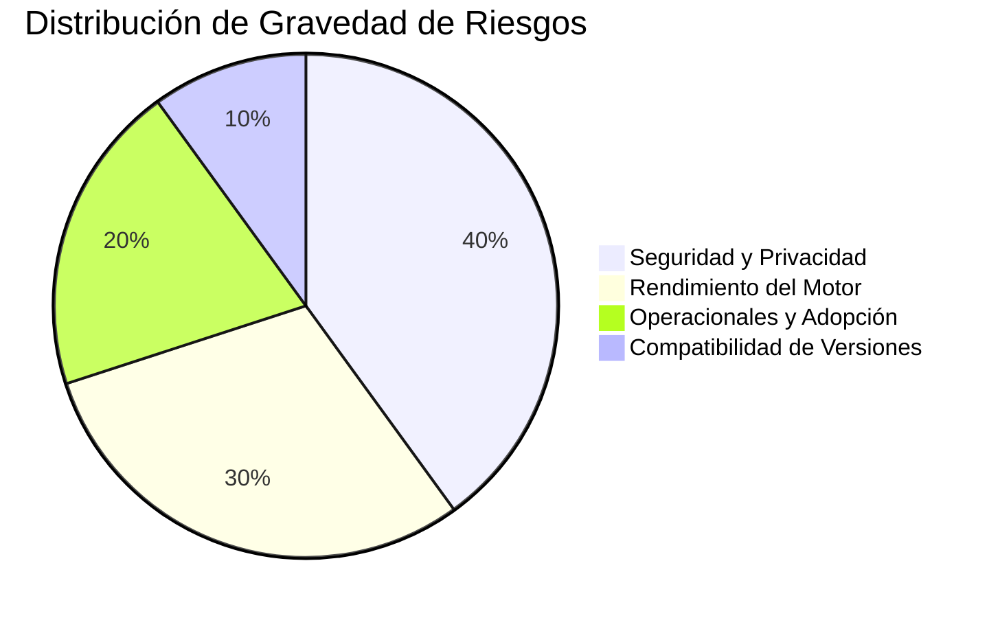
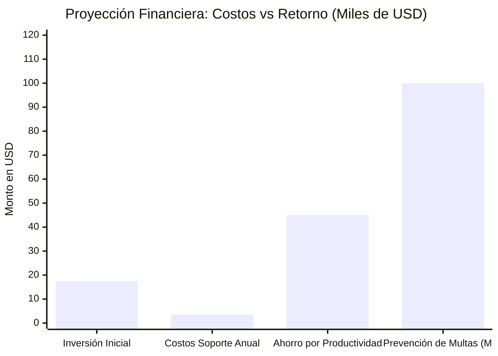

# FD01 - Informe de Factibilidad

## 1. Descripción del Proyecto

### Nombre del Proyecto
Motor de Enmascarado de Datos Multiformato (**Enmask v2.0**)

### Descripción General
El proyecto consiste en el desarrollo e implementación de una plataforma de enmascaramiento y de-sensibilización de datos diseñada para proteger información sensible y confidencial a través de múltiples motores de bases de datos y formatos. Esta herramienta permite desensibilizar datos para su uso en entornos no productivos (desarrollo, pruebas, QA) garantizando el cumplimiento de normativas de privacidad nacionales e internacionales. 

Enmask v2.0 se distingue por su soporte agnóstico para **9 motores de bases de datos** (PostgreSQL, MySQL, SQL Server, MongoDB, Cassandra, Redis, Neo4j, Oracle y SQLite) y la incorporación de un módulo de telemetría de rendimiento que evalúa la latencia y el consumo de CPU introducido por la aplicación de reglas de seguridad (overhead).

### Objetivo General
Proveer una solución unificada, escalable, de alto rendimiento y segura para el enmascaramiento estático y dinámico de datos estructurados, semi-estructurados y no estructurados (grafos y clave-valor) en diversas plataformas de almacenamiento corporativas.

### Objetivos Específicos
- **Compatibilidad Multi-Motor:** Desarrollar adaptadores de conexión eficientes para 9 motores de bases de datos relacionales, NoSQL y orientados a grafos.
- **Catálogo de Algoritmos:** Implementar técnicas avanzadas de desensibilización como hashing (SHA-256), redacción parcial, sustitución por diccionarios, perturbación numérica y cifrado simétrico reversible mediante claves maestras Fernet.
- **Monitoreo de Rendimiento:** Integrar métricas de tiempo de ejecución (lectura, transformación y escritura) para medir de forma transparente el overhead introducido por cada estrategia.
- **Interfaz Amigable:** Proveer un workbench web interactivo y una extensión de VS Code que permitan a los desarrolladores y QA mapear campos sensibles y configurar tareas sin necesidad de escribir sentencias SQL o scripts ad-hoc.
- **Trazabilidad Inmutable:** Generar reportes detallados y registros de auditoría de cada tarea ejecutada (Jobs) para facilitar auditorías externas.

### Alcance
#### Incluido en el Proyecto (Funcionalidades Entregables)
- Motor central (Core) de enmascaramiento implementado en FastAPI.
- Interfaz web interactiva en React + TypeScript y Vite con soporte de temas (claro/oscuro).
- Soporte completo para 9 motores de bases de datos con validación y normalización de URIs de conexión.
- Respaldos seguros de datos originales en un Vault cifrado antes de la ofuscación física.
- Generación de reportes de ejecución en formato JSON/PDF y base de datos local de métricas (SQLite).
- Extensión oficial para VS Code e integración con asistentes de Inteligencia Artificial mediante un servidor MCP (Model Context Protocol).

#### Excluido del Proyecto (Fuera de Alcance)
- Limpieza y depuración estructural de datos (Data Cleansing) previa.
- Sincronización automática de bases de datos de producción con réplicas en tiempo real.
- Modificaciones DDL en la base de datos de origen (el sistema solo lee y deriva hacia bases de datos de prueba).

---

## 2. Gestión de Riesgos

### Riesgos de Seguridad y Privacidad (Gravedad: Alta)
- **Fuga de datos en tránsito:** Mitigado procesando todos los datos en memoria dinámica (RAM) en forma de lotes (batches), sin escribir archivos temporales en disco.
- **Exposición de claves de conexión:** Mitigado cifrando las credenciales de base de datos almacenadas en la base de datos de metadatos mediante una clave maestra AES-256 y permitiendo el uso de variables de entorno locales.

### Riesgos de Rendimiento (Gravedad: Media-Alta)
- **Cuellos de botella con bases de datos masivas:** Mitigado implementando procesamiento paginado por lotes y promoviendo el uso de "vistas de enmascaramiento" (`masked_views`) que evitan la sobreescritura física de millones de registros en demostraciones rápidas.

### Riesgos Operacionales y de Adopción (Gravedad: Media)
- **Resistencia de los desarrolladores al uso de la herramienta:** Mitigado al integrar Enmask directamente en el entorno de desarrollo a través de una extensión de VS Code y proporcionando un servidor MCP que permite a asistentes como Claude y Copilot usar las herramientas del backend para automatizar las tareas.

---

## 3. Análisis de la Situación Actual

### 3.1. Procesos Manuales y Fragmentados
Actualmente, los desarrolladores y QA extraen datos de producción mediante scripts SQL o dumps manuales, lo que incrementa el riesgo de error humano y de fuga de datos.

### 3.2. Heterogeneidad de Motores
La infraestructura empresarial combina motores relacionales tradicionales con bases NoSQL y bases de datos orientadas a grafos para la detección de fraudes (Neo4j). No existe una herramienta única que unifique las reglas de protección entre todas ellas.

### 3.3. Problemas de Rendimiento y Bloqueos
Los scripts rudimentarios leen tablas completas sin paginación, lo que consume memoria del servidor y puede bloquear tablas transaccionales activas.

### 3.4. Riesgos Legales y Exposición de PII
Los entornos de desarrollo albergan réplicas exactas de información de clientes (nombres, correos, DNI), vulnerando la legislación vigente y exponiendo a la empresa a severas multas de las entidades fiscalizadoras.

---

## 4. Análisis de Factibilidad

### 4.1. Factibilidad Técnica
El stack tecnológico seleccionado se basa en herramientas estables y de alto rendimiento:
- **Backend:** FastAPI (Python 3.11+) por su soporte nativo asíncrono, ideal para manejar múltiples conexiones I/O sin bloquear el hilo principal.
- **Frontend:** React con Vite y TypeScript, asegurando una SPA rápida y tipada.
- **Librerías de Conexión:** Drivers nativos probados como `psycopg2`, `pymongo`, `neo4j`, `redis-py` y `pymssql`.
- **Infraestructura:** Despliegue dockerizado multi-contenedor para garantizar la consistencia en entornos de desarrollo y staging.

### 4.2. Factibilidad Económica

### 4.3. Factibilidad Legal
El diseño del software se alinea directamente con:
- **GDPR (General Data Protection Regulation):** Cumplimiento del principio de "Privacidad desde el Diseño y por Defecto" y derecho de minimización de datos.
- **Ley Peruana N° 29733 (Ley de Protección de Datos Personales):** Obligatoriedad de implementar medidas de seguridad técnicas en el tratamiento de bancos de datos personales, previniendo sanciones que pueden llegar hasta las 100 UIT.

### 4.4. Factibilidad Social
El proyecto reduce drásticamente la carga de tareas mecánicas sobre los equipos de TI. Al automatizar la generación de datos para pruebas, los desarrolladores pueden enfocarse en actividades creativas y de resolución de problemas, incrementando la satisfacción laboral.

### 4.5. Factibilidad Ambiental
El procesamiento optimizado en memoria y la paginación reducen el consumo innecesario de ciclos de CPU en el servidor de base de datos. Al acortar el tiempo de ejecución de scripts ineficientes de horas a minutos, se disminuye directamente la huella de carbono asociada al uso de servidores en la nube.

---

## 5. Conclusión del Informe
El proyecto **Enmask v2.0** cuenta con una viabilidad sobresaliente en todas sus dimensiones. Resuelve un dolor crítico de gobernanza de datos y cumplimiento legal utilizando tecnología moderna y escalable. Su desarrollo e implementación inmediata están plenamente justificados.
