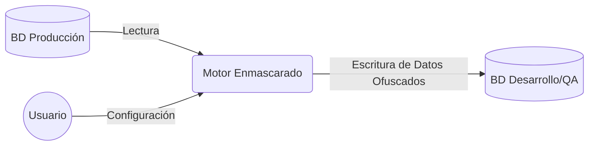

# FD02 - Informe de Visión

## 1. Introducción
### 1.1 Propósito
El propósito de este documento es definir la visión general del proyecto **Motor de Enmascarado Multiformato (Enmascaradazo)**, estableciendo los objetivos de alto nivel, problemas a resolver y las características fundamentales del producto.

### 1.2 Alcance
El sistema proveerá una plataforma para el enmascaramiento y desensibilización de datos sensibles en diversos motores de bases de datos. Está dirigido a equipos de desarrollo, QA y operaciones, quienes necesitan datos realistas sin comprometer la privacidad (PII).

### 1.3 Definiciones, Siglas y Abreviaturas
- **PII:** Personally Identifiable Information (Información Personalmente Identificable).
- **QA:** Quality Assurance (Aseguramiento de Calidad).
- **Enmascaramiento:** Proceso de ocultar datos originales con datos modificados (ficticios).

### 1.4 Referencias
- Documento FD01 - Informe de Factibilidad.
- Políticas de Seguridad de la Información corporativas.

### 1.5 Visión General
Este documento detalla el contexto del negocio, los interesados involucrados, las capacidades del producto, sus restricciones y los requerimientos de calidad.

---

## 2. Posicionamiento

### 2.1 Oportunidad de Negocio
Las organizaciones requieren usar datos de producción en entornos de prueba para detectar errores complejos. Sin embargo, las regulaciones de privacidad prohíben estrictamente el uso de PII. La oportunidad radica en automatizar la desensibilización de estos datos, reduciendo el tiempo de preparación de entornos y anulando el riesgo legal.

### 2.2 Definición del Problema
| Aspecto | Descripción |
|---------|-------------|
| **El problema de** | Exposición de datos sensibles en entornos no productivos. |
| **Afecta a** | Equipos de Desarrollo, QA y la empresa ante posibles auditorías. |
| **Cuyo impacto es** | Riesgo de multas millonarias (GDPR) y robo de identidad de clientes. |
| **Una solución ideal** | Automatizaría el proceso de ofuscación de datos mediante una herramienta centralizada y agnóstica a la base de datos. |

---

## 3. Descripción de los Interesados y Usuarios

### 3.1 Resumen de los Interesados
- **Director de TI:** Interesado en el cumplimiento normativo y reducción de costos.
- **Oficial de Seguridad (CISO):** Interesado en la protección y trazabilidad de los datos.

### 3.2 Resumen de los Usuarios
- **Ingenieros de QA:** Configuran y ejecutan el enmascaramiento para sus entornos.
- **Administradores de Bases de Datos (DBA):** Proveen acceso y validan el rendimiento del motor.

### 3.3 Entorno de Usuario
El sistema será accedido vía web a través de cualquier navegador moderno en una intranet corporativa.

### 3.4 Perfiles de los Interesados
- **CISO:** Perfil técnico avanzado, requiere reportes detallados y auditoría inmutable.

### 3.5 Perfiles de los Usuarios
- **QA / Dev:** Requiere interfaces gráficas intuitivas para seleccionar tablas y columnas, sin escribir código complejo.

### 3.6 Necesidades de los Interesados y Usuarios
- Rapidez en la ejecución.
- Soporte para múltiples orígenes de datos simultáneamente.

---

## 4. Vista General del Producto

### 4.1 Perspectiva del Producto
El producto es una aplicación web autónoma que se conecta a las bases de datos de origen (producción) y destino (pruebas).

### 4.2 Resumen de Capacidades
- **Conectores Universales:** ODBC/JDBC y nativos para SQL/NoSQL.
- **Reglas Predefinidas:** Nombres falsos, correos, tarjetas de crédito ficticias.
- **Integridad Referencial:** Mantiene la coherencia de las llaves foráneas entre tablas.

### 4.3 Suposiciones y Dependencias
- Se asume que las bases de datos origen y destino tienen la misma estructura (esquema).
- El servidor de aplicación tendrá conexión de red habilitada hacia todos los motores de base de datos implicados.

### 4.4 Costos y Precios
- Desarrollo interno, costo de horas-hombre estimado en la fase inicial.

### 4.5 Licenciamiento e Instalación
- Licencia interna / Privada corporativa. Despliegue mediante contenedores Docker.

---

## 5. Características del Producto

### 5.1 Motor de Enmascarado Multiformato
Core del sistema capaz de procesar lotes de datos y aplicar transformaciones matemáticas o de sustitución en memoria.

### 5.2 Catálogo de Técnicas de Desensibilización
Librería extensible de algoritmos (Ej: Hashing, Redacción de texto parcial, Tokenización).

### 5.3 Panel de Control y Configuración (UI)
Interfaz gráfica para gestionar conexiones y configurar las tareas de enmascaramiento.

### 5.4 Auditoría y Reportes
Registro completo de las ejecuciones, tiempo empleado y cantidad de registros afectados.

---

## 6. Restricciones

### 6.1 Restricciones de Infraestructura y Hardware
- Memoria RAM limitará el tamaño del lote de procesamiento simultáneo.

### 6.2 Restricciones Técnicas de los Motores de Datos
- Las bases de datos destino deben desactivar temporalmente triggers de auditoría si los tuvieran, para acelerar la carga.

### 6.3 Restricciones de Seguridad y Privacidad
- La aplicación nunca almacenará datos reales en su propio disco (solo tránsito en RAM).

### 6.4 Restricciones de Desarrollo (Alcance Temporal)
- MVP limitado a 3 motores principales (MySQL, SQL Server, MongoDB).

---

## 7. Rangos de Calidad

### 7.1 Disponibilidad y Escalabilidad
- 99% de disponibilidad en horario laboral para preparaciones de entorno.

### 7.2 Rendimiento (Performance)
- Capaz de enmascarar 1 millón de registros por minuto en condiciones de hardware óptimas.

### 7.3 Seguridad y Privacidad
- Conexiones forzadas por TLS/SSL.

### 7.4 Usabilidad
- La curva de aprendizaje no debe superar los 2 días para usuarios técnicos.

### 7.5 Portabilidad
- Contenedores de Linux, desplegables en AWS, Azure o entorno on-premise.

---

## 8. Precedencia y Prioridad

### 8.1 Prioridad Alta (Críticos - MVP)
- Módulo de Conexión, Técnicas base (Nombre, Email, DNI), Interfaz básica.

### 8.2 Prioridad Media (Importantes)
- Soporte para bases de datos NoSQL, reportes exportables a PDF.

### 8.3 Prioridad Baja (Deseables / Futuras)
- Auto-descubrimiento de datos sensibles (Machine Learning).

### 8.4 Matriz de Precedencia Técnica
1. Desarrollo de Drivers de Conexión.
2. Desarrollo del Motor de Transformación.
3. Desarrollo de la UI.

---

## 9. Otros Requerimientos del Producto
### a) Estándares Legales
- Cumplimiento de leyes de protección de datos vigentes (Ley 29733 en Perú, GDPR en Europa).
### b) Estándares de Comunicación
- Uso de API REST bajo protocolo HTTPS.
### c) Estándares de Cumplimiento de la Plataforma
- OWASP Top 10 para el desarrollo de la interfaz web.
### d) Estándares de Calidad y Seguridad
- Análisis de código estático previo a cada despliegue.

---

## CONCLUSIONES
El Informe de Visión consolida los objetivos y alcance del **Motor de Enmascarado Multiformato**, definiendo claramente las expectativas de los stakeholders y delimitando el primer incremento funcional del producto (MVP).

## RECOMENDACIONES
- Priorizar la validación temprana de la integridad referencial durante las pruebas.
- Validar las interfaces con los equipos de QA desde las etapas iniciales de desarrollo.

## BIBLIOGRAFÍA
- Pressman, R. S. (2010). *Ingeniería del Software: un enfoque práctico*. McGraw-Hill.
- Documentos normativos OWASP.

## WEBGRAFÍA
- https://owasp.org/
- https://www.docker.com/
