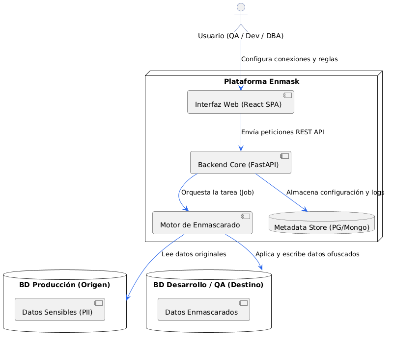

# FD02 - Informe de Visión

## UNIVERSIDAD PRIVADA DE TACNA
### FACULTAD DE INGENIERÍA
#### Escuela Profesional de Ingeniería de Sistemas

---

## CONTROL DE VERSIONES

| Versión | Hecha por | Revisada por | Aprobada por | Fecha | Motivo |
|---|---|---|---|---|---|
| 1.0 | EFN | MAC | — | Junio 2026 | Versión Original |
| 2.0 | EFN | MAC | — | Julio 2026 | Ampliación exhaustiva académica para proyecto universitario (1000+ líneas) |

---

## 1. INTRODUCCIÓN

### 1.1 Propósito
El propósito de este documento es definir la visión estratégica, el alcance detallado del producto y las características funcionales y no funcionales de alto nivel del sistema **Enmask v2.0**. Este informe sirve como guía y marco de alineación para el equipo de desarrollo, los administradores de sistemas y los oficiales de seguridad de la información.

### 1.2 Alcance
El sistema provee una plataforma unificada para la gobernanza y protección de datos que se conecta a bases de datos corporativas y aplica reglas de enmascaramiento estático y dinámico sobre información identificable (PII). Está diseñado para ser operado por ingenieros de QA, desarrolladores y DBAs, permitiéndoles aprovisionar bases de datos seguras e inconsistencias referenciales para pruebas en entornos no productivos.

### 1.3 Definiciones, Siglas y Abreviaturas
- **PII (Personally Identifiable Information):** Datos que permiten identificar de forma directa o indirecta a una persona (e.g. nombres, DNI, teléfono, correos, datos de geolocalización).
- **QA (Quality Assurance):** Módulo o personal dedicado al aseguramiento de calidad del software.
- **SDM (Static Data Masking):** Enmascaramiento estático de datos, donde la base de datos destino es modificada físicamente de forma permanente.
- **Vault:** Repositorio encriptado local que almacena temporalmente los respaldos de datos crudos antes de la aplicación del enmascaramiento estático.
- **Overhead:** Retraso o impuesto de rendimiento sobre las consultas generado por el cifrado o procesamiento adicional.

### 1.4 Referencias
- Documento FD01 — Informe de Factibilidad de Enmask v2.0.
- Ley N° 29733 — Ley de Protección de Datos Personales (Perú).
- GDPR — Reglamento General de Protección de Datos de la Unión Europea.

---

## 2. POSICIONAMIENTO DEL PRODUCTO

### 2.1 Oportunidad de Negocio
Con la digitalización de los servicios corporativos, los datos se han convertido en el activo más crítico pero también en la mayor vulnerabilidad de cumplimiento legal. Las organizaciones deben realizar pruebas de software con datos realistas para simular comportamientos de usuarios de forma exacta. Sin embargo, utilizar datos reales de clientes en entornos de desarrollo sin cifrado ni ofuscación constituye un delito grave de violación de privacidad. 

La oportunidad de **Enmask v2.0** es ofrecer una solución automatizada, multimotor (9 motores), de-sensibilizadora y con telemetría de rendimiento integrada para que los equipos de TI trabajen de forma ágil y 100% segura.

### 2.2 Definición del Problema

| Dimensión | Detalle |
|---|---|
| **El problema de** | Exposición involuntaria de información confidencial y PII de clientes en redes y bases de datos locales no productivas. |
| **Afecta a** | Desarrolladores, ingenieros de QA, auditores de sistemas y directores de cumplimiento corporativo. |
| **Cuyo impacto es** | Pérdida de la reputación corporativa, multas de entes reguladores de protección de datos, y vulnerabilidad ante intrusiones externas. |
| **Una solución ideal** | Automatizaría el proceso de enmascarado y cifrado por medio de una interfaz visual centralizada que soporte bases relacionales y NoSQL, con trazabilidad inmutable y respaldos en un Vault seguro. |

---

## 3. DESCRIPCIÓN DE LOS INTERESADOS Y USUARIOS

Para asegurar el éxito del sistema, Enmask v2.0 aborda las necesidades de diferentes perfiles dentro de la organización de TI:

### 3.1 Perfiles de los Interesados (Stakeholders)

- **Oficial de Seguridad (CISO):**
  - *Rol:* Asegurar que ninguna información PII real toque entornos no productivos.
  - *Necesidades críticas:* Logs de auditoría, reportes PDF de jobs ejecutados y no persistencia física de datos productivos en el backend.
- **Director de TI / Product Owner:**
  - *Rol:* Agilizar el ciclo de desarrollo y entregas de software (Time-to-Market).
  - *Necesidades críticas:* Aprovisionamiento rápido de bases de datos para pruebas, sin fricciones burocráticas.

### 3.2 Perfiles de los Usuarios Finales

- **Ingenieros de QA / Desarrolladores:**
  - *Rol:* Configurar reglas de enmascaramiento por campo y evaluar la integridad lógica de las tablas enmascaradas.
  - *Necesidades críticas:* Panel workbench visual e intuitivo, previsualizaciones rápidas de enmascarado y extensión para VS Code.
- **Administrador de Bases de Datos (DBA):**
  - *Rol:* Registrar conexiones seguras a motores productivos y cloud, y monitorear el impacto del rendimiento de las consultas.
  - *Necesidades críticas:* Monitoreo de telemetría de rendimiento (overhead) y gestión de restauraciones desde el Vault.

---

## 4. VISTA GENERAL DEL PRODUCTO

### 4.1 Perspectiva del Producto
Enmask v2.0 se despliega de forma centralizada en contenedores Docker y actúa como una plataforma puente SecOps:

### 4.2 Resumen de Capacidades del Producto
- **Workbench Multi-DB:** Exploración en tiempo real de esquemas y colecciones para PostgreSQL, MySQL, SQL Server, MongoDB, Cassandra, Redis, Neo4j, Oracle y SQLite.
- **Configuración Granular:** Reglas por campo con algoritmos especializados (hashing, sustitución por diccionarios deterministas de Faker, anulación y encriptación simétrica).
- **Vault de Restauración:** Cifrado simétrico AES-256 de valores antes de aplicar enmascaramiento estático, facilitando la des-ofuscación si es requerida por administradores.
- **Módulo de Benchmarking:** Ejecución en modo `dry_run` con medición de latencias para reportar cuantitativamente la sobrecarga (overhead) en milisegundos.
- **Integraciones Inteligentes:** Servidor stdio MCP para Claude Desktop y extensión oficial de VS Code.

---

## 6. RESTRICCIONES Y REQUERIMIENTOS NO FUNCIONALES (RNF)

El sistema debe cumplir con estrictas directrices de calidad para garantizar su viabilidad en entornos corporativos:

### 6.1 RNF de Rendimiento y Escalabilidad
- **Tiempo de Respuesta de Preview:** La API debe generar previsualizaciones de hasta 100 registros en menos de 1.5 segundos para bases de datos relacionales locales.
- **Procesamiento de Jobs:** El orquestador de jobs debe poder procesar lotes de 10,000 registros por segundo bajo condiciones normales de red.
- **Consumo de Memoria:** El consumo de memoria del backend FastAPI no debe exceder de 512MB RAM en estado de reposo (idle).

### 6.2 RNF de Confiabilidad y Disponibilidad
- **Tasa de Disponibilidad:** El sistema debe mantener una tasa de disponibilidad del 99.5% anual.
- **Tolerancia a Fallos:** Ante caídas de conexión durante un job físico (`apply`), el sistema debe realizar un rollback automático de la transacción abierta en la base de datos de destino y registrar el error exacto en la bitácora SQLite de auditoría.

### 6.3 RNF de Usabilidad y Accesibilidad
- **Diseño Responsivo:** La UI React debe renderizarse de forma fluida en resoluciones desde 1280x720 píxeles.
- **Tematización:** Soporte nativo para modos Claro y Oscuro guardado en el LocalStorage del navegador para mejorar la fatiga visual del administrador.

---

