# UNIVERSIDAD PRIVADA DE TACNA

## FACULTAD DE INGENIERÍA

### Escuela Profesional de Ingeniería de Sistemas

---

# Proyecto SecOps — Enmask v2.0

## Curso: BASE DE DATOS II

### Docente:
Mag. Patrick Cuadros Quiroga

### Integrantes:
- Flores Navarro, Eduardo Gino (2023076793)
- Choqueña Mauricio, Adrian (2023076799)

---

**Tacna – Perú**
**2026**

---

## CONTROL DE VERSIONES

| Versión | Hecha por | Revisada por | Aprobada por | Fecha | Motivo |
|---|---|---|---|---|---|
| 1.0 | EFN | MAC | — | Junio 2026 | Versión Original |
| 2.0 | EFN | MAC | — | Julio 2026 | Rediseño completo con diagramas PlantUML y alineación con el código real de Enmask v2.0 |

---

# FD04 — Diseño de Arquitectura Software

## Sistema Enmask v2.0

### Multi-DB Masking & Performance Overhead Monitor

---

## ÍNDICE GENERAL

| Nro | Sección | Pág |
|---|---|---|
| **1** | **INTRODUCCIÓN** | **5** |
| 1.1 | Propósito (Diagrama 4+1) | 5 |
| 1.2 | Alcance | 5 |
| 1.3 | Definición, siglas y abreviaturas | 5 |
| 1.4 | Organización del documento | 5 |
| **2** | **OBJETIVOS Y RESTRICCIONES ARQUITECTÓNICAS** | **5** |
| 2.1.1 | Requerimientos Funcionales | 5 |
| 2.1.2 | Requerimientos No Funcionales – Atributos de Calidad | 5 |
| **3** | **REPRESENTACIÓN DE LA ARQUITECTURA DEL SISTEMA** | **6** |
| 3.1 | Vista de Caso de Uso | 6 |
| 3.1.1 | Diagramas de Casos de Uso | 6 |
| 3.2 | Vista Lógica | 6 |
| 3.2.1 | Diagrama de Subsistemas (paquetes) | 7 |
| 3.2.2 | Diagramas de Secuencia (vista de diseño) | 7 |
| 3.2.3 | Diagrama de Colaboración (vista de diseño) | 7 |
| 3.2.4 | Diagrama de Objetos | 7 |
| 3.2.5 | Diagrama de Clases | 7 |
| 3.2.6 | Diagrama de Base de datos (relacional y no relacional) | 7 |
| 3.3 | Vista de Implementación (vista de desarrollo) | 7 |
| 3.3.1 | Diagrama de arquitectura software (paquetes) | 7 |
| 3.3.2 | Diagrama de arquitectura del sistema (componentes) | 7 |
| 3.4 | Vista de Procesos | 7 |
| 3.4.1 | Diagrama de Procesos del sistema (actividad) | 8 |
| 3.5 | Vista de Despliegue (vista física) | 8 |
| 3.5.1 | Diagrama de despliegue | 8 |
| **4** | **ATRIBUTOS DE CALIDAD DEL SOFTWARE** | **8** |
| | Escenario de Funcionalidad | 8 |
| | Escenario de Usabilidad | 8 |
| | Escenario de Confiabilidad | 9 |
| | Escenario de Rendimiento | 9 |
| | Escenario de Mantenibilidad | 9 |
| | Otros Escenarios | 9 |

---

## 1. INTRODUCCIÓN

### 1.1. Propósito (Diagrama 4+1)

El presente documento tiene como propósito definir la **arquitectura software** del sistema **Enmask v2.0**, aplicando el modelo de vistas **"4+1"** de Philippe Kruchten. Este modelo permite describir la arquitectura desde múltiples perspectivas, cada una abordando las preocupaciones de diferentes interesados:

| Vista | Interesado Principal | Propósito |
|---|---|---|
| **Lógica** | Desarrolladores | Estructura de clases, objetos y subsistemas |
| **Procesos** | Integradores de sistemas | Concurrencia, sincronización y flujo de datos |
| **Desarrollo** | Gestores de configuración | Organización del código, módulos y dependencias |
| **Física** | Ingenieros de infraestructura | Despliegue en nodos, contenedores y redes |
| **Casos de Uso** | Todos los interesados | Escenarios que validan las demás vistas |

El documento sirve como referencia técnica para el equipo de desarrollo, el docente del curso y los futuros mantenedores del sistema, garantizando que las decisiones arquitectónicas estén documentadas, justificadas y trazables.

### 1.2. Alcance

El alcance de este documento abarca la arquitectura completa del sistema Enmask v2.0, incluyendo:

- **Backend:** Aplicación monolítica en **FastAPI (Python)** estructurada siguiendo principios de arquitectura limpia y diseño guiado por el dominio (DDD).
- **Frontend:** Aplicación de una sola página (SPA) desarrollada en **React + Vite + TypeScript**, estilizada con Tailwind CSS y equipada con gráficos interactivos.
- **Persistencia de Metadatos:** Configurable mediante repositorios en memoria, MongoDB o PostgreSQL (`REPOSITORY_BACKEND`).
- **Seguridad:** Autenticación local mediante hashes de contraseñas con bcrypt, JWT para la gestión de sesiones, soporte para Google OAuth2 y encriptación simétrica mediante Fernet (AES-128-CBC) gestionada a través de claves maestras.
- **Motores Destino Soportados (9):** PostgreSQL, MySQL, MariaDB, SQLite, SQL Server, Oracle Database, Apache Cassandra, MongoDB y Redis.
- **Integraciones Externas:** Extensión de VS Code, Servidor MCP para agentes e IA, y Skills empaquetados para asistentes virtuales.

### 1.3. Definición, siglas y abreviaturas

| Término | Definición |
|---|---|
| **API** | Application Programming Interface |
| **BD** | Base de Datos |
| **DDD** | Domain-Driven Design |
| **FPE** | Format-Preserving Encryption |
| **Fernet** | Algoritmo de cifrado simétrico basado en AES-128-CBC |
| **JWT** | JSON Web Token |
| **PII** | Personally Identifiable Information |
| **RDBMS** | Relational Database Management System |
| **SDM** | Static Data Masking |
| **SRP** | Single Responsibility Principle |
| **REST** | Representational State Transfer |
| **UML** | Unified Modeling Language |
| **MCP** | Model Context Protocol |

### 1.4. Organización del documento

Este documento se estructura en 4 secciones principales:
1. **Introducción** — Contexto y propósito del documento.
2. **Objetivos y Restricciones Arquitectónicas** — Requerimientos que guían las decisiones de diseño.
3. **Representación de la Arquitectura** — Las 5 vistas del modelo 4+1 (Lógica, Procesos, Desarrollo, Física, Casos de Uso) modeladas en PlantUML.
4. **Atributos de Calidad** — Escenarios de evaluación de la arquitectura.

---

## 2. OBJETIVOS Y RESTRICCIONES ARQUITECTÓNICAS

### 2.1.1. Requerimientos Funcionales

Los requerimientos funcionales que impactan directamente en las decisiones arquitectónicas son:

| ID | Requerimiento | Impacto Arquitectónico |
|---|---|---|
| RF-001 | Conectar a motor de BD | Requiere el patrón Factory para instanciar clientes de 9 motores soportados. |
| RF-002 | Previsualización de Datos | Requiere servicio workbench que realice consultas sin persistir cambios (*Dry-Run*). |
| RF-003 | Enmascaramiento por Campo | Requiere diseño extensible de estrategias de enmascaramiento (*Strategy Pattern*). |
| RF-004 | Ejecución de Jobs | Requiere un orquestador asíncrono para ejecutar los modos *dry_run* y *apply*. |
| RF-005 | Cifrado Simétrico | Requiere módulo de criptografía con almacenamiento en Vault local de valores originales. |
| RF-006 | Deshacer / Restaurar | Requiere control transaccional de artefactos creados y des-enmascaramiento del Vault. |
| RF-007 | Panel de Auditoría | Requiere persistir un historial detallado de jobs de enmascaramiento. |
| RF-008 | Autenticación y Roles | Requiere un módulo de autenticación con rol de administrador auditable. |

### 2.1.2. Requerimientos No Funcionales – Atributos de Calidad

| ID | Atributo | Requisito Arquitectónico |
|---|---|---|
| RNF-001 | Rendimiento | Respuestas rápidas en previsualizaciones; procesamiento en streaming o batches en base de datos. |
| RNF-002 | Seguridad | Hashes bcrypt, encriptación Fernet, almacenamiento seguro de llaves de cifrado en variables de entorno o archivos protegidos. |
| RNF-003 | Extensibilidad | Patrón Factory para añadir nuevos clientes de bases de datos sin modificar el núcleo del orquestador. |
| RNF-004 | Concurrencia | FastAPI asíncrono soportado por `asyncio` y clientes asíncronos cuando es posible (`asyncpg`, `aiomysql`). |
| RNF-005 | Portabilidad | Contenerización completa con Docker y orquestación con Docker Compose. |

#### Restricciones Arquitectónicas

| Restricción | Descripción |
|---|---|
| **Lenguaje** | Python 3.12+ (backend), TypeScript (frontend) |
| **Frameworks** | FastAPI (backend), React + Vite (frontend) |
| **Criptografía** | Clave simétrica Fernet de 32 bytes provista por criptografía de Python. |
| **Comunicación** | Protocolo HTTP/JSON (REST) para peticiones web y STDIO JSON-RPC para integraciones MCP. |

---

## 3. REPRESENTACIÓN DE LA ARQUITECTURA DEL SISTEMA

### 3.1. Vista de Caso de Uso

La vista de caso de uso sirve como validación de que la arquitectura soporta las necesidades de negocio del sistema.

#### 3.1.1. Diagramas de Casos de Uso

El siguiente diagrama en PlantUML muestra los actores que interactúan con el sistema Enmask v2.0 y las funcionalidades expuestas.

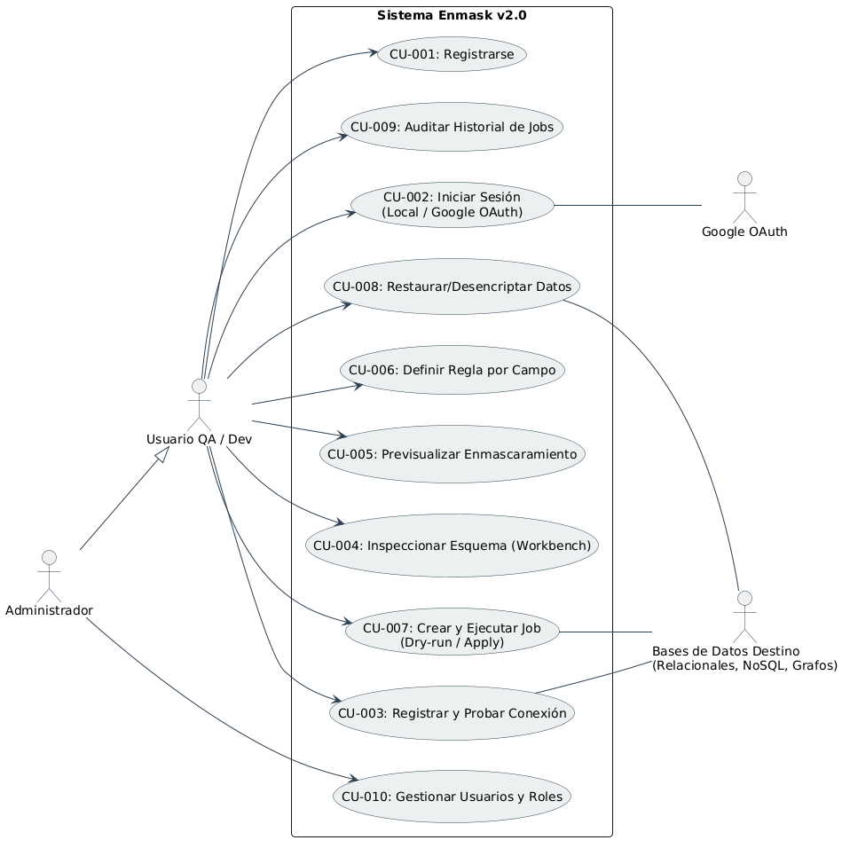

**Trazabilidad Casos de Uso → Módulos del Sistema:**

| Caso de Uso | Componentes Involucrados |
|---|---|
| CU-001/002: Registro/Login | `auth.py` (Endpoints), `auth_service.py` (Dominio), `UserRepository` (Metadatos) |
| CU-003: Registrar/Probar Conexión | `connections.py`, `connection_service.py`, `DatabaseFactory` |
| CU-004/005: Inspección & Preview | `workbench.py`, `workbench_service.py`, `DatabaseFactory` |
| CU-006: Definir Regla | `rules.py`, `ConnectionRepository` |
| CU-007: Ejecutar Job | `jobs.py`, `job_orchestrator.py`, `masking_service.py`, `DatabaseFactory` |
| CU-008: Restaurar Datos | `job_orchestrator.py`, `vault_repository.py` |
| CU-009: Auditoría | `reports.py`, `AuditLogRepository` |
| CU-010: Admin Roles | `auth.py`, `auth_service.py` (validación de variable de entorno `ADMIN_EMAILS`) |

---

### 3.2. Vista Lógica

La vista lógica describe la estructura estática del sistema en términos de subsistemas, clases y relaciones de persistencia.

#### 3.2.1. Diagrama de Subsistemas (paquetes)

El sistema está dividido en capas de acuerdo con los principios de Clean Architecture y Domain-Driven Design (DDD).

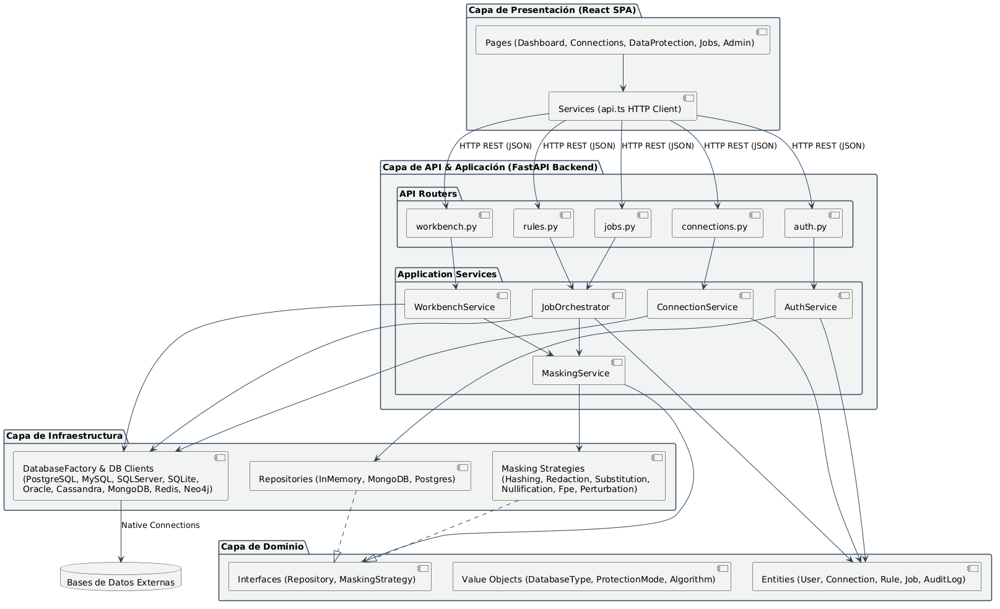

#### 3.2.2. Diagramas de Secuencia (vista de diseño)

##### Secuencia: Autenticación de Usuario (Login)

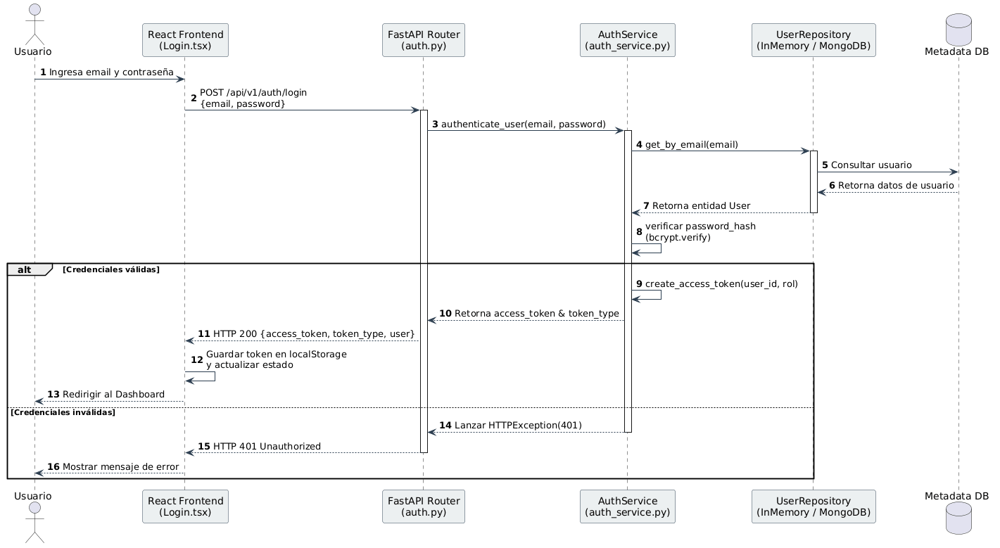

##### Secuencia: Ejecución de Job de Enmascaramiento

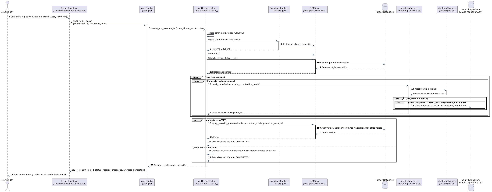

#### 3.2.3. Diagrama de Colaboración (vista de diseño)

El siguiente diagrama representa cómo los diferentes componentes del backend colaboran para cumplir con el proceso de enmascaramiento.

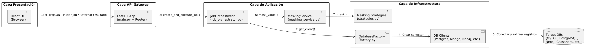

#### 3.2.4. Diagrama de Objetos

Este diagrama de objetos describe las instancias que se relacionan en tiempo de ejecución para ejecutar un Job sobre una conexión específica.

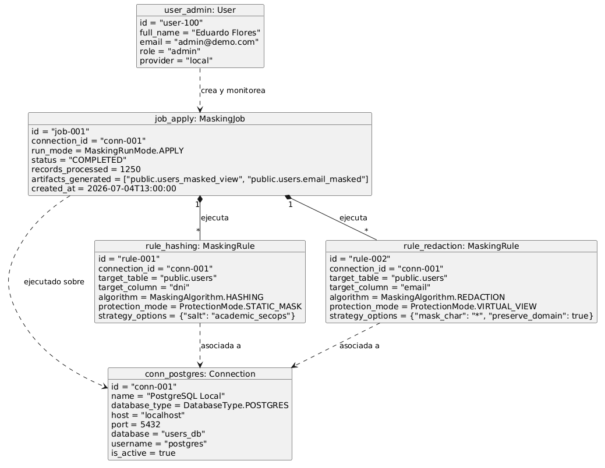

#### 3.2.5. Diagrama de Clases

El diseño orientado a objetos del backend utiliza el patrón **Factory** para abstracción de motores y **Strategy** para la flexibilidad de algoritmos de enmascaramiento.

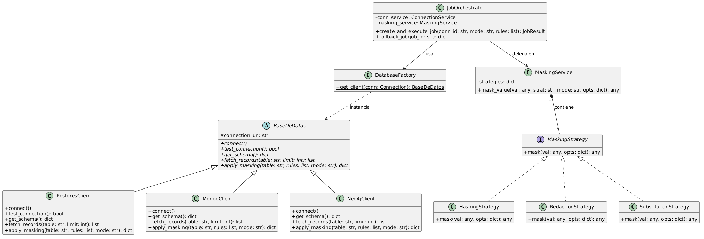

#### 3.2.6. Diagrama de Base de datos (relacional y no relacional)

##### Modelo Lógico de Metadatos (SQLite / MongoDB / PostgreSQL)

Representa las tablas que soportan el funcionamiento interno del sistema (usuarios, conexiones configuradas, reglas y auditoría).

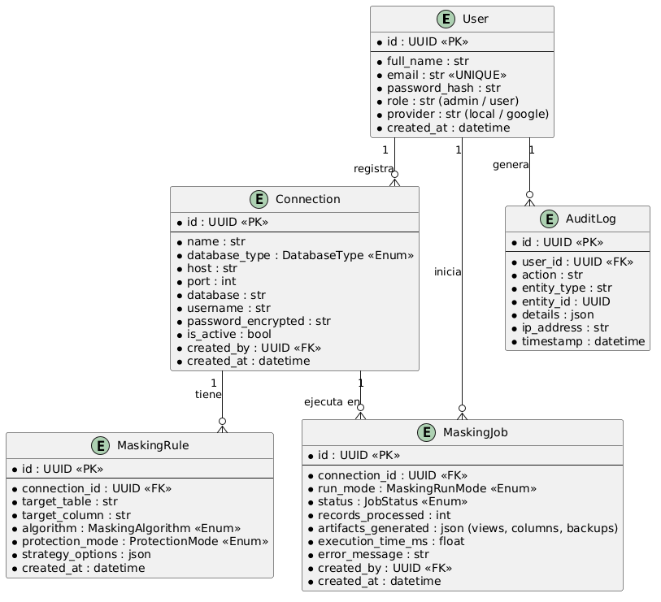

##### Modelos de Datos en Motores Externos (Destinos de Ejemplo)

- **MongoDB (Colección NoSQL):** Soportado mediante mapeo de objetos planos de BSON.
  ```json
  {
    "_id": "64b1f45c8f2a4f001a2b3c4d",
    "nombre": "Eduardo Flores",
    "email": "edu@mail.com",
    "dni": "12345678",
    "dni_masked": "1234****",
    "telefono": "+51 987654321"
  }
  ```

- **Neo4j (Modelo de Grafos):** Soportado a nivel de propiedades del Label.
  ```text
  (:Persona {nombre: "Eduardo", dni: "12345678", dni_masked: "1234****"}) -[:TRABAJA_EN]-> (:Empresa {razon_social: "SecOps SAC"})
  ```

---

### 3.3. Vista de Implementación (vista de desarrollo)

La vista de desarrollo muestra la organización del código fuente en módulos físicos y sus dependencias.

#### 3.3.1. Diagrama de arquitectura software (paquetes)

El siguiente diagrama representa la jerarquía física y distribución de componentes dentro del repositorio.

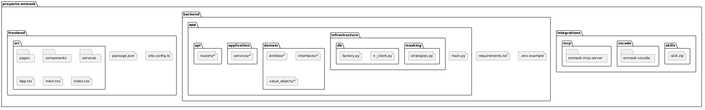

#### 3.3.2. Diagrama de arquitectura del sistema (componentes)

Muestra los componentes del sistema en ejecución y cómo se comunican de forma desacoplada mediante protocolos definidos.

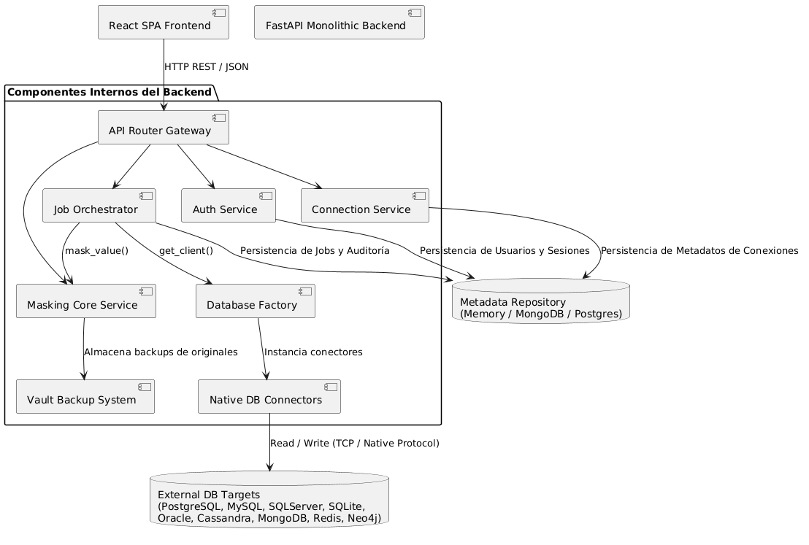

---

### 3.4. Vista de Procesos

La vista de procesos aborda la concurrencia, sincronización de hilos y el flujo dinámico de ejecución de tareas críticas en el sistema.

#### 3.4.1. Diagrama de Procesos del sistema (diagrama de actividad)

El flujo dinámico del proceso desde la autenticación hasta la ejecución de enmascaramiento se representa a continuación:

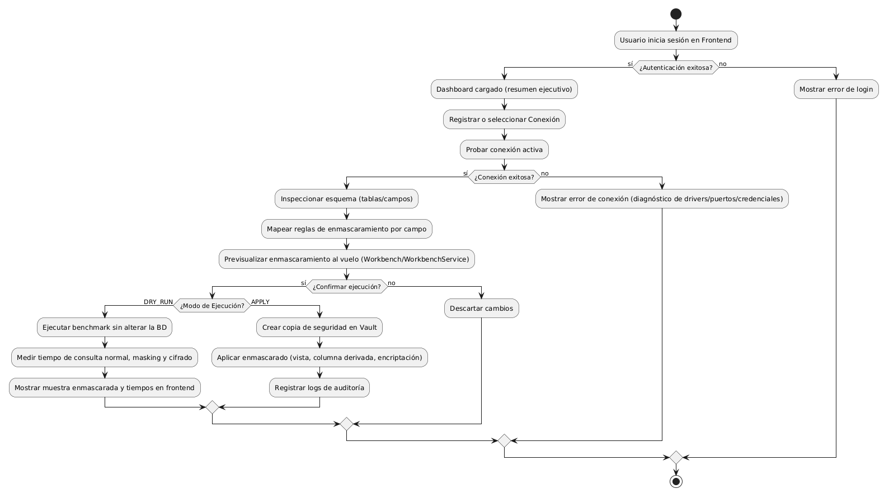

---

### 3.5. Vista de Despliegue (vista física)

La vista física describe la distribución física del sistema en hardware o contenedores de red, incluyendo los protocolos de interconexión.

#### 3.5.1. Diagrama de despliegue

El despliegue de Enmask v2.0 se realiza típicamente usando contenedores independientes orquestados por Docker Compose en entornos de desarrollo/QA, o a través de servicios de aplicación en la nube (Render).

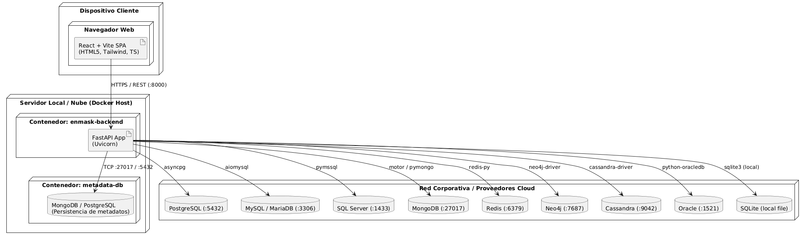

---

## 4. ATRIBUTOS DE CALIDAD DEL SOFTWARE

Los atributos de calidad se evalúan mediante escenarios estructurados que describen el comportamiento esperado frente a estímulos del entorno.

### Escenario de Funcionalidad

| Aspecto | Descripción |
|---|---|
| **Escenario** | Un usuario autenticado ejecuta una previsualización de enmascaramiento en el Workbench. |
| **Estímulo** | Solicitud POST `/api/v1/workbench/preview` enviando reglas definidas. |
| **Respuesta del sistema** | El orquestador extrae los registros de la base de datos origen usando el cliente correcto, aplica los algoritmos de enmascaramiento configurados sin guardarlos en la base de datos destino, y devuelve el resultado en menos de 2 segundos. |
| **Medida de calidad** | Validación visual en el Workbench con los datos correctos ofuscados; no se altera el dato original en este paso. |
| **Arquitectura implicada** | `workbench.py` (Router) → `WorkbenchService` → `DatabaseFactory` → `MaskingService` → `strategies.py` |

### Escenario de Usabilidad

| Aspecto | Descripción |
|---|---|
| **Escenario** | El usuario necesita configurar un enmascaramiento para una base de datos documental (MongoDB). |
| **Estímulo** | Selección de MongoDB en la pantalla de "Conexiones" e ingreso de URI. |
| **Respuesta del sistema** | El sistema valida la estructura de la conexión, extrae las colecciones y muestra un Workbench adaptado a campos JSON de documentos en lugar de columnas tabulares rígidas. |
| **Medida de calidad** | El usuario finaliza la configuración en 3 clics y obtiene previsualización inmediata. |
| **Arquitectura implicada** | React UI (`Connections.tsx`) → `ConnectionService` → `MongoClient` |

### Escenario de Confiabilidad

| Aspecto | Descripción |
|---|---|
| **Escenario** | Fallo en la comunicación de red con una base de datos remota a mitad de un Job. |
| **Estímulo** | Pérdida de socket TCP durante la ejecución del job. |
| **Respuesta del sistema** | El conector de base de datos correspondiente atrapa el error de red, aborta el job de forma segura, cambia su estado a `FAILED` en los metadatos y guarda el mensaje detallado de error para auditoría sin corromper la consistencia de los datos ya procesados. |
| **Medida de calidad** | Estado consistente en la base de datos y reporte de fallo con diagnóstico claro en el historial de Jobs. |
| **Arquitectura implicada** | `job_orchestrator.py` → `BaseDeDatos` (Manejo de excepciones) → `AuditLogRepository` |

### Escenario de Rendimiento

| Aspecto | Descripción |
|---|---|
| **Escenario** | Múltiples peticiones concurrentes de previsualización sobre el backend. |
| **Estímulo** | 20 peticiones simultáneas desde diferentes clientes. |
| **Respuesta del sistema** | FastAPI maneja las solicitudes asíncronas de manera concurrente usando el bucle de eventos (`asyncio`), repartiendo la carga de procesamiento sin saturar el hilo principal. |
| **Medida de calidad** | Tiempo de respuesta promedio menor a 3 segundos; uso de CPU controlado (< 70%). |
| **Arquitectura implicada** | Uvicorn Server → FastAPI Router → Async Services |

### Escenario de Mantenibilidad

| Aspecto | Descripción |
|---|---|
| **Escenario** | Se requiere agregar un nuevo algoritmo de enmascaramiento por requerimiento regulatorio. |
| **Estímulo** | Modificación del código fuente para añadir el algoritmo. |
| **Respuesta del sistema** | El desarrollador crea una nueva clase en `strategies.py` implementando la interfaz `MaskingStrategy` y la registra en el diccionario de estrategias del `MaskingService`. No se requiere modificar el orquestador principal. |
| **Medida de calidad** | Tiempo de desarrollo < 1 hora; cero cambios en la lógica de control del orquestador. |
| **Arquitectura implicada** | `strategies.py` (Strategy Pattern) → `MaskingService` |

---

*Documento FD04 — Diseño de Arquitectura Software*
*Sistema Enmask v2.0 — Multi-DB Masking & Performance Overhead Monitor*
*Versión 2.0 — Julio 2026*
