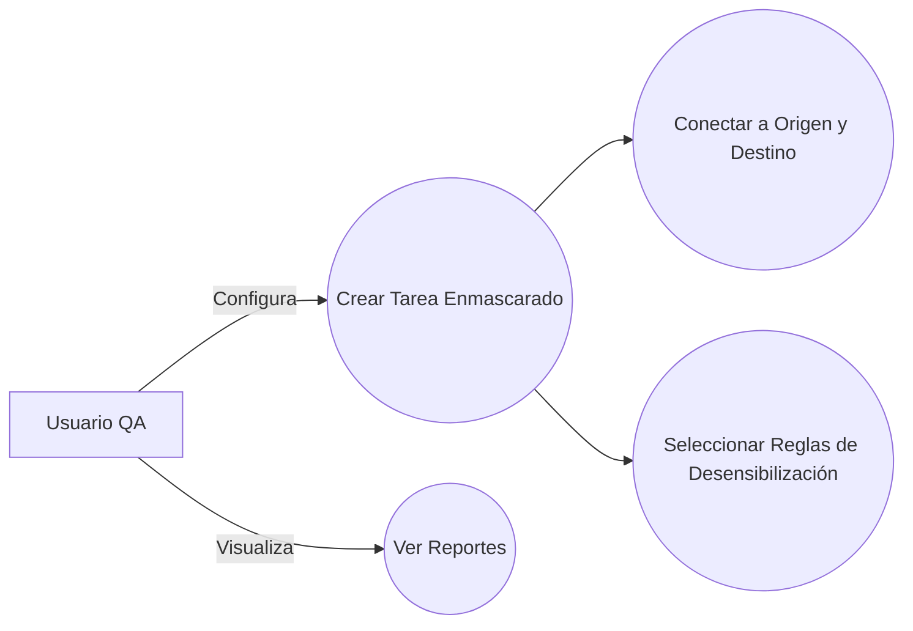
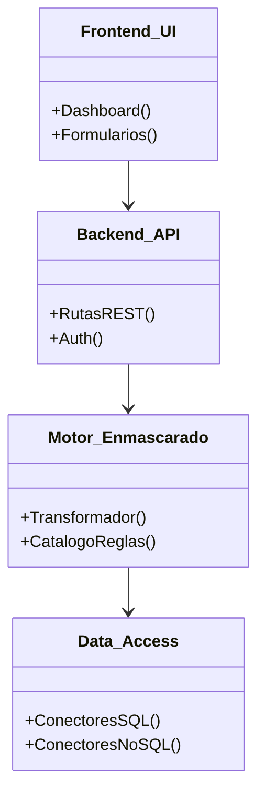
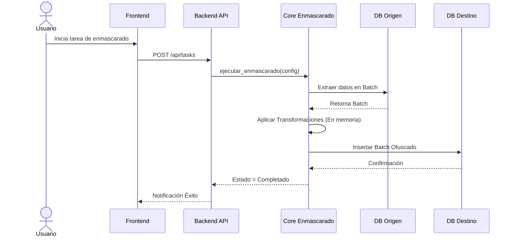
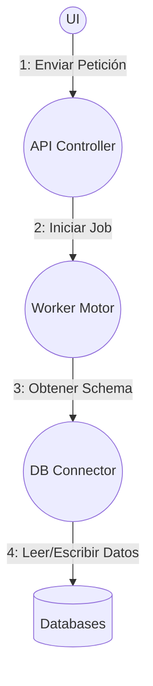
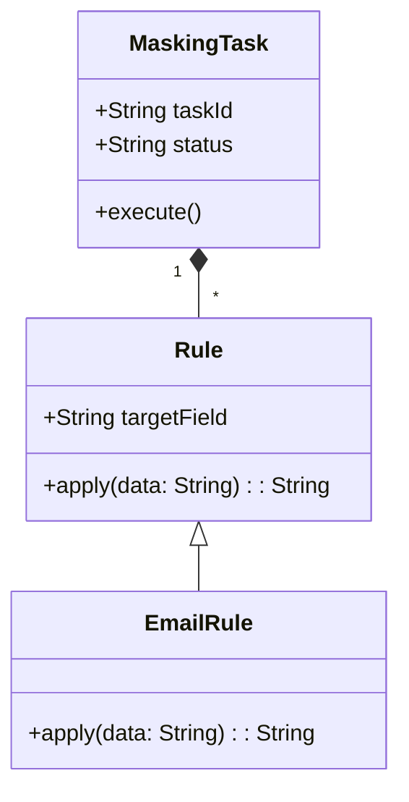
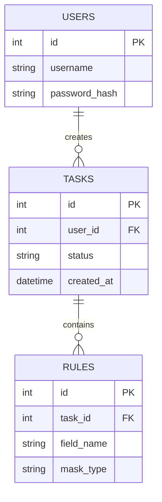
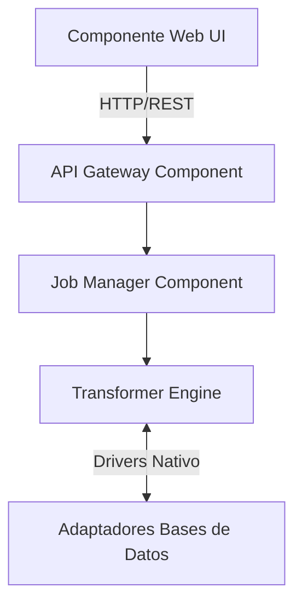
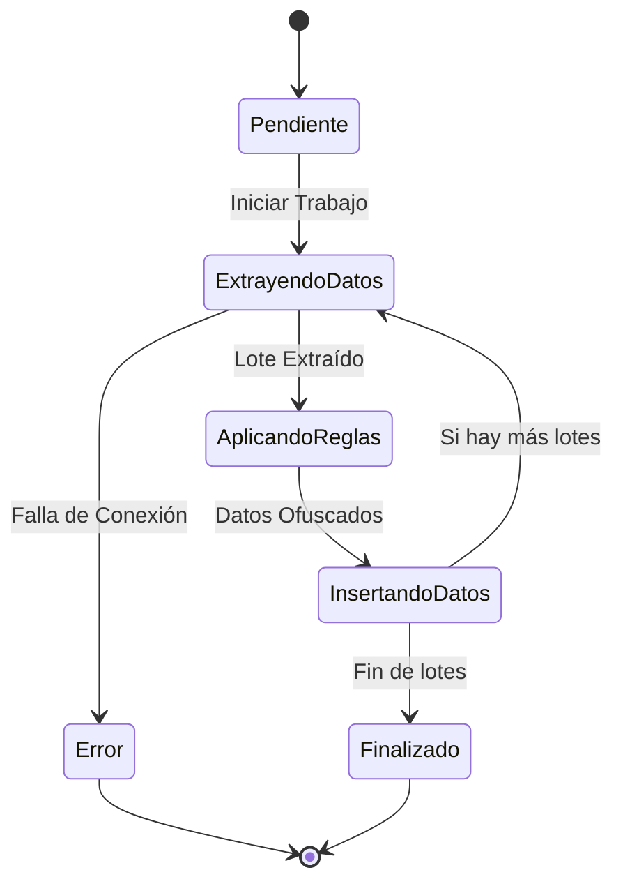
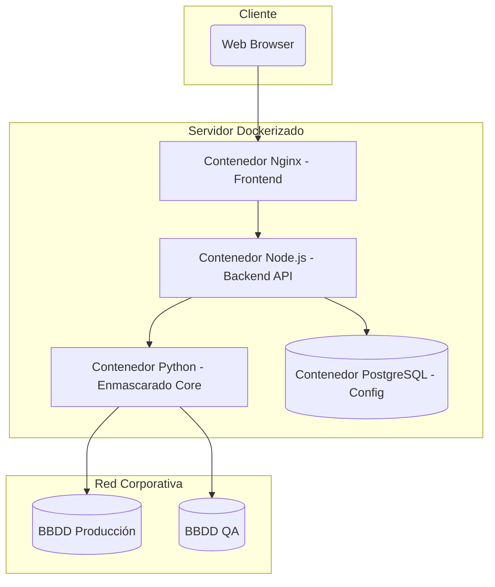

# FD04 - Informe de Arquitectura

## Propósito (Modelo 4+1 Vistas)
Este documento provee una visión general comprensiva de la arquitectura del **Motor de Enmascarado Multiformato (Enmascaradazo)**, utilizando el modelo 4+1 vistas (Lógica, Implementación, Procesos, Despliegue y Casos de Uso) para capturar las diferentes perspectivas del sistema.

## Alcance
La arquitectura descrita abarca todos los módulos del motor de ofuscación de datos, la API backend, y el Dashboard frontend, así como sus interacciones con las bases de datos de origen y destino.

## Definición, Siglas y Abreviaturas
- **API:** Application Programming Interface.
- **UI:** User Interface.
- **DTO:** Data Transfer Object.

## Organización del Documento
El documento está organizado según las vistas de arquitectura, seguido de escenarios de calidad.

## Requerimientos Funcionales
- **RF1:** El sistema permitirá conectar a bases de datos SQL y NoSQL.
- **RF2:** El sistema aplicará reglas de enmascaramiento configurables por columna/campo.
- **RF3:** El sistema generará reportes de ejecución.

## Requerimientos No Funcionales – Atributos de Calidad
- **RNF1 (Seguridad):** Los datos extraídos no serán persistidos temporalmente en disco.
- **RNF2 (Rendimiento):** Procesamiento de hasta 1 millón de registros por minuto.

---

## Vista de Caso de Uso

### Diagramas de Casos de Uso



### Descripción de Casos de Uso Principales:
- **Crear Tarea Enmascarado:** El usuario especifica las credenciales, selecciona las tablas y aplica las reglas para ofuscar los datos.

---

## Vista Lógica

### Diagrama de Subsistemas (Paquetes)



### Diagrama de Secuencia (Vista de Diseño)



### Diagrama de Colaboración (Vista de Diseño)



### Diagrama de Objetos

```mermaid
classDiagram
    object Tarea1 {
        id = "TASK-001"
        estado = "En progreso"
        motor = "PostgreSQL"
    }
    object Regla1 {
        tipo = "FakerName"
        columna = "nombres"
    }
    Tarea1 -- Regla1 : contiene
```

### Diagrama de Clases



### Diagrama de Base de Datos (Relacional o No Relacional)



---

## Vista de Implementación (Vista de Desarrollo)

### Diagrama de Arquitectura de Software (Paquetes)

```mermaid
flowchart LR
    subgraph Capa Presentación
        UI[React App]
    end
    subgraph Capa Lógica (Servicios)
        API[Express / FastAPI]
        TaskQueue[Queue Worker]
    end
    subgraph Capa Datos
        AppDB[(Configuración DB)]
    end
    UI --> API
    API --> TaskQueue
    API --> AppDB
```

### Diagrama de Arquitectura del Sistema (Diagrama de Componentes)



---

## Vista de Procesos

### Diagrama de Procesos del Sistema (Diagrama de Actividad)



---

## Vista de Despliegue (Vista Física)

### Diagrama de Despliegue



---

## Escenario de Funcionalidad
### Escenario 1: Detección de Múltiples Motores
El sistema puede conectar un PostgreSQL de origen y derivar los datos hacia un MySQL destino si los esquemas son compatibles, demostrando la agnosticidad del motor de enmascaramiento.

### Escenario 2: Aplicación de Reglas por Expresión Regular
Se permite buscar patrones como tarjetas de crédito y reemplazar los primeros 12 dígitos por asteriscos en campos de texto libre.

### Escenario 3: Generación de Reportes en Múltiples Formatos
Al terminar una tarea, se expide un reporte en JSON o PDF detallando los campos alterados para auditoría.

---

## Escenario de Usabilidad
### Escenario 1: Interfaz Intuitiva
El usuario mapea tablas y columnas arrastrando (drag-and-drop) o seleccionando en menús desplegables sin escribir queries SQL.

### Escenario 2: Mensajes de Error Claros
Si la conexión a la base de datos de origen falla, se detalla si el error fue por credenciales, host inaccesible, o falta de permisos de lectura.

### Escenario 3: Progreso en Tiempo Real
Un socket en tiempo real mantiene informado al usuario del porcentaje de avance de la ofuscación.

---

## Escenario de Confiabilidad
### Escenario 1: Manejo de Caídas de Red
Si la conexión con el destino falla a la mitad del proceso, la tarea se detiene limpiamente y queda en estado "Error recuperable", sin corromper el metadato del sistema.

### Escenario 2: Integridad Referencial
El sistema mantiene un mapeo consistente. Ej: Si el "ID 10" se reemplaza por "ID 99", las llaves foráneas dependientes también serán actualizadas de manera consistente.

### Escenario 3: Cobertura de Pruebas
El motor de reglas cuenta con >80% de cobertura de pruebas unitarias para asegurar que los datos sensibles nunca escapen intactos por errores de código.

---

## Escenario de Rendimiento
### Escenario 1: Procesamiento por Lotes (Batching)
El sistema extrae datos de 10,000 en 10,000 filas (configurable) para no agotar la RAM del servidor.

### Escenario 2: Uso de Memoria
El pico máximo de consumo de RAM está acotado por el tamaño del lote, haciendo la aplicación predecible.

### Escenario 3: Ejecución Concurrente
Múltiples tablas que no tienen dependencias entre sí pueden ser enmascaradas por el sistema simultáneamente usando multi-threading (hilos).

---

## Escenario de Mantenibilidad
### Escenario 1: Adición de Nuevo Patrón
El sistema utiliza un patrón Strategy; añadir una nueva regla de enmascaramiento implica solo crear una nueva clase heredera, sin modificar el core del procesamiento.

### Escenario 2: Adición de Nuevo Conector
Si la empresa adopta Oracle DB en el futuro, se puede integrar creando un adaptador específico respetando la interfaz de conexión estándar.

---

## Otros Escenarios
### Escenario: Seguridad - Prevención de Exposición
El propio log del sistema de enmascarado ofusca el contenido de los valores; solo indica "Se ofuscaron 5,000 registros en tabla Users".

### Escenario: Compatibilidad Multiplataforma
Los contenedores garantizan que el sistema funcionará de forma idéntica en Windows, Linux y macOS.

---

## Resumen de Atributos de Calidad
- **Alta Extensibilidad:** Arquitectura basada en plugins/adaptadores para motores y reglas.
- **Eficiencia Segura:** Enmascarado al vuelo sin persistir datos en discos intermedios.

## Fortalezas
- Agnosticismo de base de datos.
- Arquitectura limpia y escalable.

## Limitaciones Conocidas
- Puede requerir mucho tiempo para petabytes de datos debido al cuello de botella de la red (I/O).
- No resuelve el enmascarado estructural (cambio de esquemas).

## Roadmap - Fase 2 (Futuro)
- Enmascarado en bases de datos orientadas a grafos.
- Descubrimiento automático de columnas que parecen contener PII usando IA.
