# FD04 - Informe de Arquitectura

## Propósito (Modelo 4+1 Vistas)
Este documento provee una visión general comprensiva de la arquitectura del **Motor de Enmascarado Multiformato (Enmask v2.0)**, utilizando el modelo 4+1 vistas (Lógica, Implementación, Procesos, Despliegue y Casos de Uso) de Philippe Kruchten para capturar las diferentes perspectivas del sistema.

## Alcance
La arquitectura descrita abarca todos los módulos del motor de ofuscación de datos, la API backend en FastAPI, y la aplicación de control en React+Vite, así como sus interacciones con las bases de datos de origen y destino.

## Definición, Siglas y Abreviaturas
- **API:** Application Programming Interface.
- **UI:** User Interface.
- **DTO:** Data Transfer Object.
- **DDD:** Domain-Driven Design.
- **MCP:** Model Context Protocol.

## Organización del Documento
El documento está organizado según las vistas de arquitectura, seguido de escenarios de calidad y roadmaps del proyecto.

## Requerimientos Funcionales
- **RF1:** El sistema permitirá conectar a bases de datos SQL y NoSQL (9 motores soportados).
- **RF2:** El sistema aplicará reglas de enmascaramiento configurables por columna/campo.
- **RF3:** El sistema generará vistas previas y reportes de ejecución (Jobs) en modo Dry-Run o Apply.
- **RF4:** El sistema contará con autenticación local y control de roles (administrador auditable).

## Requerimientos No Funcionales – Atributos de Calidad
- **RNF1 (Seguridad):** Los datos extraídos no serán persistidos temporalmente de forma insegura; el enmascaramiento se realiza al vuelo y el cifrado simétrico guarda respaldos protegidos en un Vault local.
- **RNF2 (Extensibilidad):** Añadir nuevos motores a través del patrón Factory sin alterar la lógica de Jobs del orquestador.
- **RNF3 (Rendimiento):** Procesamiento eficiente asíncrono con FastAPI y consultas paginadas o por lotes (Batching).

---

## Vista de Caso de Uso

### Diagramas de Casos de Uso

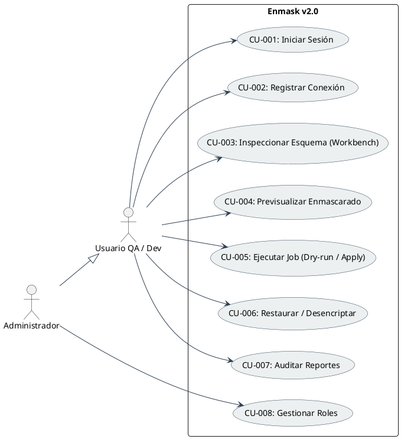

### Descripción de Casos de Uso Principales:
- **Ejecutar Job:** El usuario configura las reglas de protección por campo, y el orquestador ejecuta el enmascarado en modo *Dry-run* (simulación de muestra) o *Apply* (creación física de vistas, columnas duplicadas o reemplazo físico con encriptación reversada).

---

## Vista Lógica

### Diagrama de Subsistemas (Paquetes)

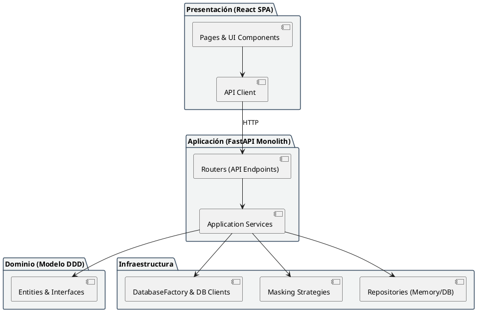

### Diagrama de Secuencia (Vista de Diseño)

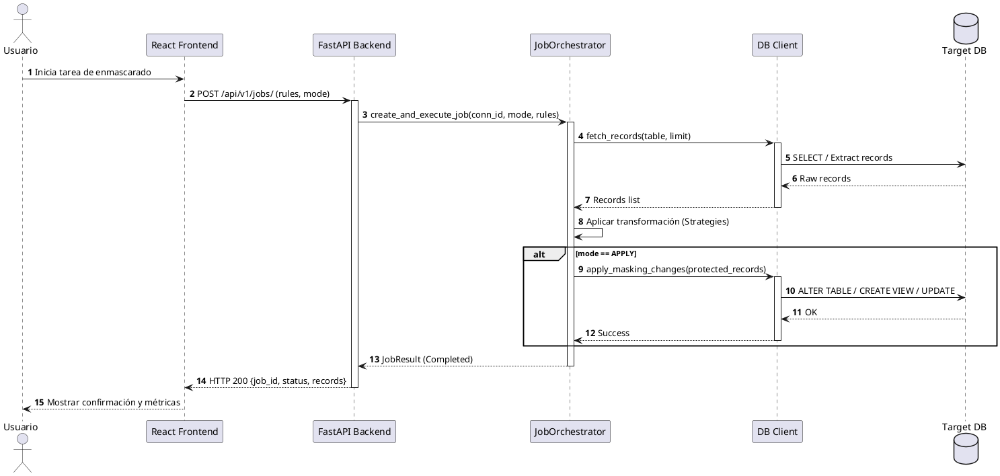

### Diagrama de Colaboración (Vista de Diseño)

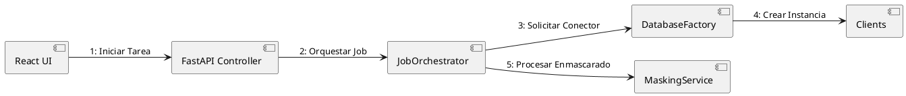

### Diagrama de Objetos

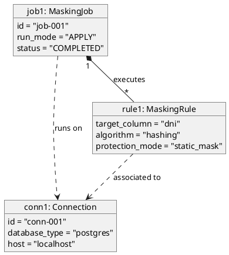

### Diagrama de Clases

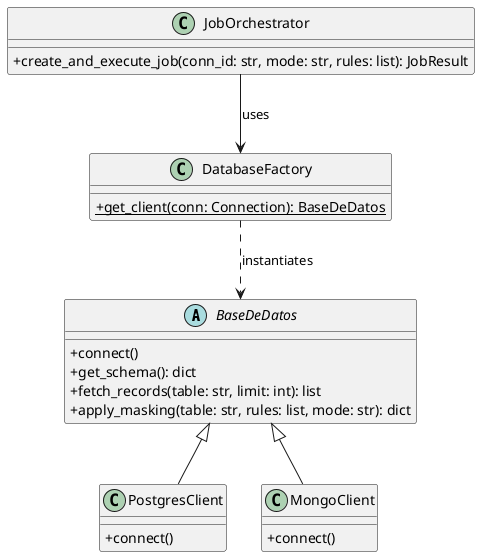

### Diagrama de Base de Datos (Relacional o No Relacional)

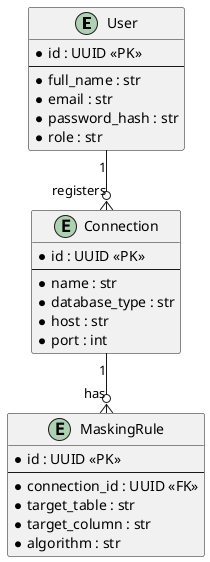

---

## Vista de Implementación (Vista de Desarrollo)

### Diagrama de Arquitectura de Software (Paquetes)

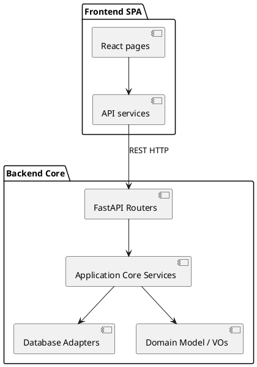

### Diagrama de Arquitectura del Sistema (Diagrama de Componentes)

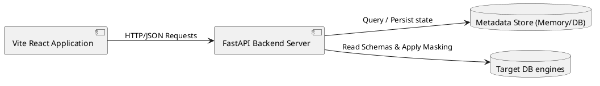

---

## Vista de Procesos

### Diagrama de Procesos del Sistema (Diagrama de Actividad)

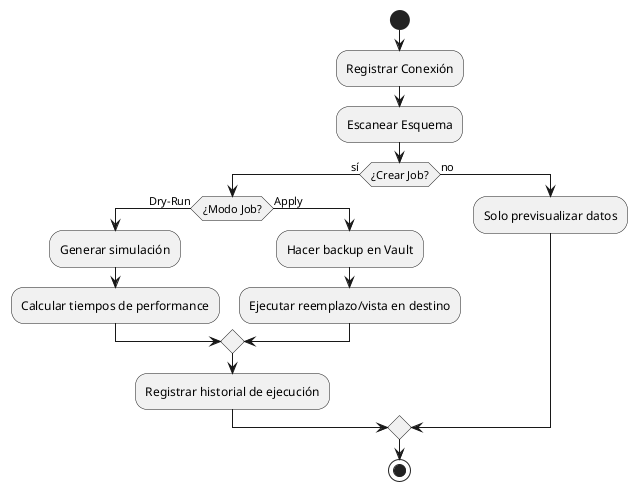

---

## Vista de Despliegue (Vista Física)

### Diagrama de Despliegue

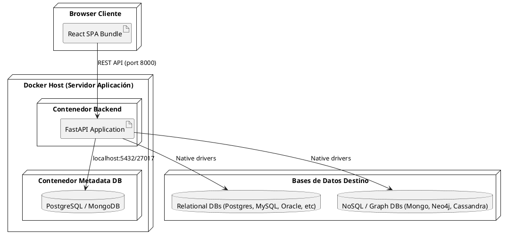

---

## Escenario de Funcionalidad
### Escenario 1: Soporte Multimotor
El sistema puede conectar un PostgreSQL de origen y derivar/enmascarar los datos hacia motores NoSQL (como MongoDB o Redis) de manera agnóstica basándose en la configuración de la conexión.

### Escenario 2: Protección no destructiva (Vistas y Columnas Derivadas)
Para demostraciones seguras, el sistema crea una vista de enmascaramiento (`masked_view`) en lugar de alterar físicamente los datos originales en la tabla.

### Escenario 3: Encriptación reversible
El sistema cifra valores sensibles usando una clave maestra Fernet y permite restaurar la información desde el módulo histórico o de des-enmascarado.

---

## Escenario de Usabilidad
### Escenario 1: Workbench de Enmascaramiento Intuitivo
El usuario mapea tablas y columnas visualmente desde la pantalla **Protección de Datos**, seleccionando el algoritmo y modo en dropdowns y viendo el resultado final inmediatamente.

### Escenario 2: Diagnóstico de Conexiones
Si la conexión falla, el sistema proporciona una sugerencia de diagnóstico detallando si el error se debe a host inalcanzable, credenciales erróneas o drivers ausentes.

---

## Escenario de Confiabilidad
### Escenario 1: Resiliencia de Transacciones
Si una actualización falla físicamente durante la aplicación de enmascaramiento, el Job se marca como `FAILED` y se detiene la secuencia limpia para no dejar la base de datos destino en un estado inconsistente.

### Escenario 2: Integridad Referencial
El sistema mantiene la consistencia de valores enlazados si se definen reglas unificadas por tipo de datos a nivel global.

---

## Escenario de Rendimiento
### Escenario 1: Procesamiento por Lotes
La lectura y enmascaramiento físico de tablas pesadas se procesa en batches paginados para evitar desbordes de memoria RAM en el backend.

### Escenario 2: Asincronismo
El uso de FastAPI asíncrono previene el bloqueo de peticiones de otros usuarios mientras se procesan tareas largas de base de datos.

---

## Escenario de Mantenibilidad
### Escenario 1: Adición de nuevos Algoritmos
Gracias al patrón Strategy, añadir un nuevo tipo de máscara sólo requiere implementar una clase más en `strategies.py` sin reescribir el orquestador principal.

---

## Fortalezas
- Agnosticismo de base de datos completo (9 motores).
- Arquitectura limpia basada en DDD.
- Separación de responsabilidades clara entre UI y backend.

## Limitaciones Conocidas
- Tareas sobre petabytes de datos están acotadas a la capacidad de la red y throughput del driver.

## Roadmap - Fase Futura
- Implementar descubrimiento automático de PII utilizando técnicas avanzadas de expresión regular y heurística.
- Soporte para enmascarado dinámico en tiempo de ejecución.
