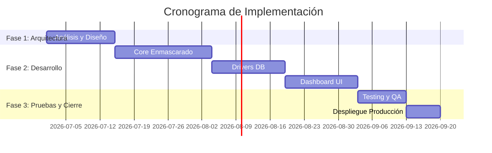

# FD06 - Propuesta de Proyecto

## Resumen Ejecutivo
Esta propuesta describe la implementación del **Motor de Enmascarado Multiformato (Enmascaradazo)**, una herramienta integral diseñada para extraer, desensibilizar y depositar datos hacia entornos de prueba. El objetivo es mitigar completamente el riesgo de fugas de datos de Información Personal Identificable (PII) durante las fases de desarrollo y prueba.

---

## I. Propuesta Narrativa

### 1. Planteamiento del Problema
Las políticas de cumplimiento prohíben estrictamente el uso de información real de usuarios en entornos de QA. El uso de scripts manuales para alterar bases de datos enteras es insostenible e introduce un alto riesgo de fuga debido a errores humanos.

### 2. Justificación del proyecto
El proyecto se justifica por la protección del principal activo de la empresa: sus datos. La automatización del ofuscamiento representará una reducción de costos operativos y garantizará el paso sin observaciones de auditorías externas.

### 3. Objetivo General
Proporcionar una solución automatizada, segura y fácil de operar para ofuscar información sensible en diversos repositorios de bases de datos, con una latencia aceptable.

### 4. Beneficios
- **Seguridad:** Datos reales nunca tocan entornos de prueba.
- **Eficiencia:** Reducción del tiempo de preparado de datos de días a minutos.
- **Trazabilidad:** Reportes claros de qué se ha ofuscado.

### 5. Alcance
Se entregará el Core Processing, adaptadores para 3 bases de datos base, un UI Dashboard web, y despliegue sobre Docker.

### 6. Requerimientos del Sistema
- Plataforma Linux para el hosting del motor.
- Acceso por puerto habilitado hacia las bases de origen y destino.
- Recursos: mínimo 8GB RAM para evitar bloqueos durante el proceso de lotes pesados.

### 7. Restricciones
- La herramienta no modificará estructuralmente las bases de datos origen ni destino (no ejecuta DDL).

### 8. Supuestos
- Los administradores de base de datos facilitarán credenciales de solo lectura en origen y escritura en destino.

### 9. Resultados Esperados
Un sistema funcional con una curva de aprendizaje mínima, que logre ejecutar un proceso de desensibilizado de 500k filas en menos de 3 minutos.

### 10. Metodología de Implementación
Se empleará metodología Ágil (Scrum) con iteraciones (Sprints) de 2 semanas, asegurando entregas funcionales incrementales.

### 11. Actores Claves
- Sponsor del Proyecto (Directorio).
- Product Owner (Oficial de Seguridad de la Información).
- Equipo de Desarrollo.

### 12. Papel y Responsabilidades del Personal
- **Lead Developer:** Define la arquitectura del Core.
- **UI/UX Engineer:** Diseña y programa el panel de control.
- **QA Tester:** Valida la integridad de las transformaciones y la usabilidad.

### 13. Plan de Monitoreo y Evaluación
Las tareas de enmascaramiento emitirán telemetría a herramientas como Prometheus y Grafana (o similar) para observar rendimiento y tiempos de ejecución reales.

### 14. Cronograma del Proyecto

### 15. Hitos de Entregables
- Hito 1: Aprobación de Arquitectura (Semana 2).
- Hito 2: Core capaz de procesar PostgreSQL a PostgreSQL (Semana 6).
- Hito 3: UI conectada y funcional (Semana 9).

---

## II. Presupuesto

### 1. Planteamiento de aplicación del presupuesto
El presupuesto se distribuye principalmente en las horas de desarrollo (Capital Expenses) y la infraestructura inicial necesaria para pruebas y el primer año de operación.

### 2. Presupuesto (USD)
| Ítem | Costo Estimado |
|---|---|
| Equipo de Desarrollo (4 meses) | $15,000 |
| Hosting y Servidores de Prueba (12 meses) | $2,000 |
| Licenciamiento de herramientas de análisis | $500 |
| **Total** | **$17,500** |

### 3. Análisis de Factibilidad
Como se detalla en el FD01, la reducción de riesgos y el ahorro de horas operativas sustentan el valor de la inversión.

### 4. Evaluación Financiera
El Payback Period (retorno de inversión) esperado es menor a 12 meses.

---

## Anexo 01 – Requerimientos del Sistema (Motor de Enmascarado)
- **Requerimiento 1.1:** El usuario debe poder definir reglas de enmascaramiento personalizadas.
- **Requerimiento 1.2:** El sistema debe notificar por correo la finalización de una tarea.
- **Requerimiento 1.3:** Soporte para ofuscación parcial (e.g. mantener los últimos 4 dígitos de la tarjeta).
