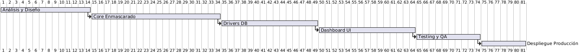

# FD06 - Propuesta de Proyecto

## Resumen Ejecutivo
Esta propuesta describe la implementación del **Motor de Enmascarado de Datos Multiformato (Enmask v2.0)**, una solución unificada diseñada para la gobernanza, ofuscación y de-sensibilización de datos sensibles en entornos corporativos de desarrollo y pruebas. Al automatizar la sustitución de Información Personal Identificable (PII) por valores sintéticos pero válidos, el sistema mitiga el riesgo de filtraciones y garantiza el cumplimiento normativo legal.

---

## I. Propuesta Narrativa

### 1. Planteamiento del Problema
Las regulaciones modernas de privacidad de datos prohíben estrictamente el uso de información de clientes reales en entornos de control de calidad o desarrollo. El uso tradicional de scripts manuales y aislados es insostenible:
- Genera inconsistencias referenciales entre motores.
- Carece de una auditoría centralizada.
- Requiere gran cantidad de horas operativas manuales por parte del equipo de DBAs.

### 2. Justificación del Proyecto
Enmask v2.0 centraliza y automatiza el enmascarado y cifrado de datos mediante una arquitectura escalable de FastAPI y React, soportando 9 motores de datos. Además de mitigar completamente los riesgos de sanciones legales, el sistema incorpora telemetría en tiempo real (Benchmark) que cuantifica e informa sobre el impacto en el rendimiento de los servidores (overhead).

### 3. Objetivos
- **Objetivo General:** Desarrollar y desplegar una plataforma web unificada de enmascaramiento estático y dinámico compatible con 9 motores de bases de datos, con medición automática de rendimiento.
- **Objetivos Específicos:**
  - Implementar 6 estrategias avanzadas de ofuscación de datos.
  - Habilitar una base de datos segura y unificada de logs de auditoría.
  - Proveer integraciones de asistencia inteligente mediante una extensión de VS Code y un servidor MCP para agentes.

### 4. Cronograma de Implementación

### 5. Hitos y Entregables del Proyecto
- **Hito 1: Aprobación del Diseño Funcional e Interfaces (Semana 2)**
  - Entregable: Documento FD01 a FD03 completados, esquemas conceptuales y mocks de UI.
- **Hito 2: Core Engine y Patrón Factory (Semana 6)**
  - Entregable: Módulo core de enmascarado asíncrono y clientes de bases de datos relacionales completados.
- **Hito 3: Workbench Web y Reportes de Auditoría (Semana 10)**
  - Entregable: Interfaz React conectada al backend, visualización de métricas de overhead y logs de auditoría en SQLite.
- **Hito 4: Extensión de VS Code y Servidor MCP (Semana 14)**
  - Entregable: Instalable `.vsix` funcional y servidor stdio MCP compatible con Claude Desktop.
- **Hito 5: Pruebas de Carga y Aceptación Final (Semana 16)**
  - Entregable: Reportes de QA y puesta en marcha del despliegue Dockerizado.

---

## II. Presupuesto y Viabilidad

### 1. Estimación del Presupuesto (USD)

| Categoría | Concepto | Costo Estimado |
|---|---|---|
| **CAPEX** | Desarrollo de Software (Lead Backend + Frontend + QA) | $15,000 |
| **OPEX** | Servidores de Pruebas y Cloud Staging (12 meses) | $2,000 |
| **OPEX** | Licencias de Herramientas y Auditoría de Código | $500 |
| **Total** | **Inversión Inicial del Proyecto** | **$17,500** |

### 2. Retorno de Inversión (ROI)
El ROI del proyecto se proyecta a **6 meses** después de su lanzamiento, justificado por:
- Ahorro de 40 horas/semana en aprovisionamiento manual de datos.
- Mitigación del 100% del riesgo de multas regulatorias de protección de datos personales.
- Incremento en la velocidad de ciclos de pruebas de QA.
